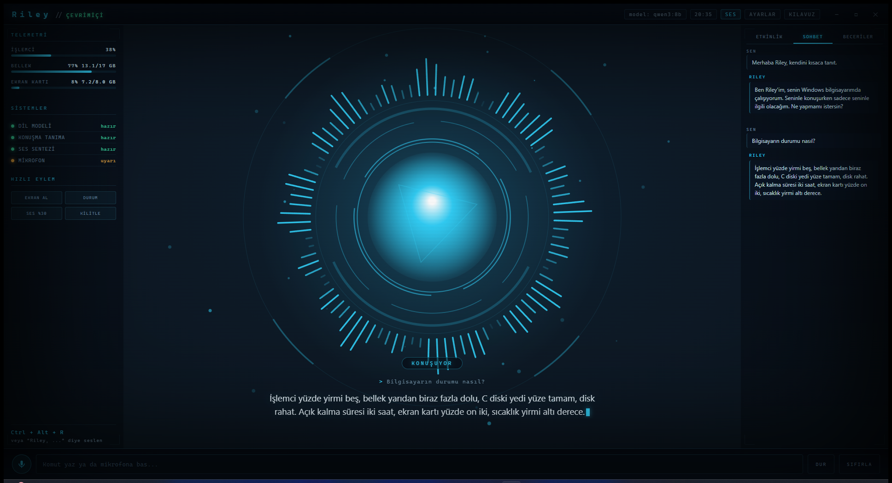

<div align="center">

# Riley

**Bilgisayarınızda çalışan, Türkçe konuşan, tamamen yerel bir sesli yapay zekâ asistanı.**

Bulut yok, abonelik yok, API anahtarı yok. Konuştuğunuz ses de, düşünen model de,
cevap veren ses de kendi makinenizde kalır.




</div>

---

## Ne yapar

"Riley, sesi kıs" dersiniz, sesi kısar. "Ekran görüntüsü al" dersiniz, alır.
Bilgisayarınızın durumunu sorarsınız, bakar ve söyler. Bir dosya oluşturmasını
isterseniz oluşturur. İnternette arar, özetler, hatırlar.

Ekranda ise bunların hepsini bir bilim kurgu arayüzünde izlersiniz: sesinizle
hareket eden bir reaktör, canlı sistem göstergeleri, hangi aracı ne zaman
çağırdığını gösteren bir etkinlik akışı.

## Öne çıkanlar

| | |
|---|---|
| **Tamamen yerel** | Ses, metin ve model — hiçbiri makineden çıkmaz |
| **Türkçe** | Türkçe konuşur, Türkçe anlar, Türkçe seslendirir |
| **Adıyla uyanır** | "Riley, ..." demeniz yeter; kısayol tuşu da var |
| **Gerçekten iş yapar** | 38 beceri: uygulama, pencere, dosya, ses, ekran, web, hatırlatıcı |
| **Onay ister** | Silme, kapatma gibi geri alınamaz işlerde sorar |
| **Hatırlar** | "Bunu unutma" dediğiniz şeyler oturumlar arası kalır |
| **Sözü kesilebilir** | Konuşurken araya girin, susar ve sizi dinler |
| **Hatırlatıcılar kalıcı** | Riley kapansa bile hatırlatmalar korunur |

## Nasıl çalışır

```
  Mikrofon
     │
     ▼
  webrtcvad ──── konuşma bitti mi?
     │
     ▼
  Whisper (faster-whisper, GPU)        ← konuşma → metin
     │
     ▼
  "Riley," ile mi başlıyor? ─── hayır ──► yok say
     │ evet
     ▼
  qwen3:8b (Ollama)                    ← düşünür, araç seçer
     │
     ├──► Beceriler: uygulama aç, dosya yaz, ses ayarla, web ara...
     │
     ▼
  Piper (tr_TR-dfki)                   ← metin → konuşma
     │
     ▼
  Hoparlör            ⇅ WebSocket ⇅    HUD arayüzü (Electron)
```

Cevap üretilirken cümle tamamlandıkça seslendirilir — Riley cevabın tamamını
beklemeden konuşmaya başlar.

## Gereksinimler

- **Windows 10/11**
- **Python 3.10+** ([indir](https://www.python.org/downloads/) — kurulumda
  *Add Python to PATH* işaretli olsun)
- **Node.js 18+** (isteğe bağlı, masaüstü penceresi için)
- **~12 GB boş disk** (model 5 GB, ses tanıma 0.5 GB, geri kalanı kütüphaneler)
- **8 GB RAM** en az; NVIDIA ekran kartı varsa ses tanıma belirgin hızlanır

> RTX 5060 (8 GB) + i5-14400F üzerinde geliştirildi ve test edildi:
> ses tanıma 0.15 sn, dil modeli 65 token/sn.

## Kurulum

```powershell
git clone https://github.com/esadbacaci/Riley.git
cd Riley
powershell -ExecutionPolicy Bypass -File scripts\kurulum.ps1
```

Kurulum betiği sırayla: Ollama'yı kurar, dil modelini indirir, Python
paketlerini kurar, NVIDIA kartı varsa CUDA kütüphanelerini ekler, Piper Türkçe
ses modelini indirir ve Electron'u hazırlar.

Daha küçük bir modelle başlamak isterseniz:

```powershell
powershell -ExecutionPolicy Bypass -File scripts\kurulum.ps1 -Model qwen3:4b
```

## Kullanım

```powershell
.\baslat.ps1               # masaüstü penceresi
.\baslat.ps1 -Tarayici     # tarayıcıda aç
.\baslat.ps1 -Sessiz       # mikrofon kapalı, yalnızca yazarak
```

### Açılış ve kısayol

Masaüstündeki `Riley` kısayoluna atanmış **Ctrl + Alt + R** ile uygulama kapalıyken
bile açılır. Açıkken aynı tuş Riley'yi dinlemeye geçirir.

Windows ile birlikte başlatmak için tepsi simgesine sağ tıklayıp **Windows ile
başlat** seçeneğini işaretleyin; Riley açılışta pencere açmadan tepsiye yerleşir.

**Konuşmak için üç yol var:**

1. **Adıyla seslenin** — "Riley, hava nasıl?" (mikrofon sürekli dinler ama
   yalnızca adı geçince harekete geçer)
2. **Kısayol** — `Ctrl + Alt + R`, sonra konuşun
3. **Yazın** — alttaki kutuya yazıp Enter

Riley cevap verdikten sonra **8 saniye boyunca** adını söylemeden konuşmaya
devam edebilirsiniz. Konuşurken sözünü kesmek için `Esc` veya "dur" deyin.

### Örnek komutlar

```
Riley, sesi yüzde otuza indir
Chrome'u aç
Masaüstüne notlar.txt oluştur, içine alışveriş listesi yaz
Bilgisayarın durumu nasıl
Ekran görüntüsü al
Bugün İstanbul'da hava nasıl
Bana on dakika sonra çayı hatırlat
Adım Esad, bunu unutma
```

## Arayüz

- **Sol** — işlemci, bellek, ekran kartı göstergeleri; sistem durumları; hızlı eylemler
- **Orta** — sesle hareket eden reaktör, konuşma altyazısı
- **Sağ** — üç sekme: **Etkinlik** (ne yaptığının kaydı), **Sohbet** (konuşma dökümü),
  **Beceriler** (yapabildiklerinin listesi)
- **Ayarlar** — konuşma hızı, atmosfer sesi, uyandırma kipi, model seçimi,
  yetki seviyesi, hatırladıkları

Arka plandaki atmosfer sesi tamamen sentetiktir (Web Audio ile canlı üretilir),
hiçbir ses dosyası içermez ve Riley'nin durumuna göre değişir.

## Beceriler

<details>
<summary><b>38 becerinin tam listesi</b></summary>

**Uygulamalar ve pencereler** — `open_app`, `close_app`, `list_windows`,
`focus_window`, `get_active_window`, `snap_window`, `close_window`, `minimize_all`

**Dosyalar** — `search_files`, `search_in_files`, `list_dir`, `read_file`,
`write_file`, `open_path`, `delete_path`*

**Sistem** — `set_volume`, `get_volume`, `mute`, `media_control`,
`take_screenshot`, `system_stats`, `lock_screen`, `shutdown`*, `cancel_shutdown`,
`clipboard_read`, `clipboard_write`, `type_text`

**Web** — `web_search`, `fetch_page`, `open_url`, `search_youtube`

**Zaman ve hafıza** — `get_datetime`, `set_timer`, `list_timers`, `cancel_timer`,
`remember`, `recall`, `forget`

<sub>\* onay ister</sub>

</details>

## Yetki seviyeleri

Ayarlardan değiştirilebilir:

- **Dar** — yalnızca okuma ve uygulama açma; hiçbir dosya değişmez
- **Orta** *(varsayılan)* — Masaüstü, Belgeler ve İndirilenler altında dosya
  işlemleri serbest; silme ve kapatma onay ister
- **Geniş** — her şey açık, yalnızca kritik işlemlerde onay

## Yapılandırma

Tüm ayarlar [`backend/config.py`](backend/config.py) içindedir ve arayüzden
değiştirilenler `data/settings.json` dosyasına yazılır.

Ortam değişkenleri:

| Değişken | Ne yapar |
|---|---|
| `RILEY_MODEL` | Kullanılacak Ollama modeli |
| `RILEY_PORT` | Sunucu portu (varsayılan 8756) |
| `RILEY_VOICE` | Piper ses modeli adı |
| `RILEY_NO_MIC=1` | Mikrofonu tamamen kapatır |

## Sorun giderme

<details>
<summary><b>Riley beni duymuyor</b></summary>

Ayarlar → Uyandırma kipini kontrol edin. Adınızı söylediğinizde etkinlik
akışında `(bana değil)` satırları görüyorsanız Whisper adı yanlış anlıyor
demektir; `backend/config.py` içindeki `wake.names` listesine duyulan biçimi
ekleyin. Kısayol (`Ctrl+Alt+R`) her zaman çalışır.
</details>

<details>
<summary><b>"cublas64_12.dll bulunamadı" hatası</b></summary>

CUDA kütüphaneleri eksik. Şunu çalıştırın:

```powershell
python -m pip install nvidia-cublas-cu12 nvidia-cudnn-cu12
```

Riley bu hatayı yakalarsa kendiliğinden işlemciye düşer, çalışmaya devam eder.
</details>

<details>
<summary><b>Ollama'ya bağlanılamıyor</b></summary>

```powershell
ollama serve
ollama list
```

Model listede yoksa `ollama pull qwen3:8b` çalıştırın.
</details>

<details>
<summary><b>Ses çok yavaş / çok hızlı</b></summary>

Ayarlar → Konuşma hızı. Küçük değer daha hızlı konuşur (0.80 varsayılan).
</details>

<details>
<summary><b>Sessizlikte alakasız cümleler çıkıyor</b></summary>

Whisper'ın bilinen davranışı. Riley bunları süzer; kaçan bir kalıp olursa
`backend/audio/stt.py` içindeki `HALLUCINATIONS` listesine ekleyin.
</details>

## Geliştirme

```powershell
python -m pytest tests/ -q
```

Testler model, mikrofon ya da ağ gerektirmez; sayı okuma, marka düzeltme,
gürültü süzgeci, uyandırma kalıbı, söz kesme mantığı, hatırlatıcı kalıcılığı
ve geçmiş özetleme saf mantık olarak sınanır.

## Proje yapısı

```
backend/
  main.py            FastAPI sunucusu, WebSocket, açılış sırası
  config.py          tüm ayarlar
  core/              olay veri yolu, durum makinesi
  audio/             mikrofon, ses tanıma, seslendirme, metin normalleştirme
  brain/             Ollama istemcisi, ajan döngüsü, kişilik
  skills/            33 beceri, yetki denetimi ile
frontend/            HUD arayüzü (HTML/CSS/Canvas/Web Audio)
desktop/             Electron kabuğu
scripts/             kurulum ve model indirme betikleri
```

## Kullanılan açık kaynak projeler

[Ollama](https://ollama.com) · [Qwen3](https://github.com/QwenLM/Qwen3) ·
[faster-whisper](https://github.com/SYSTRAN/faster-whisper) ·
[Piper](https://github.com/rhasspy/piper) ·
[openWakeWord](https://github.com/dscripka/openWakeWord) ·
[FastAPI](https://fastapi.tiangolo.com) · [Electron](https://electronjs.org)

Türkçe ses modeli: `tr_TR-dfki-medium` ([piper-voices](https://huggingface.co/rhasspy/piper-voices))

## Lisans

MIT — bkz. [LICENSE](LICENSE)
